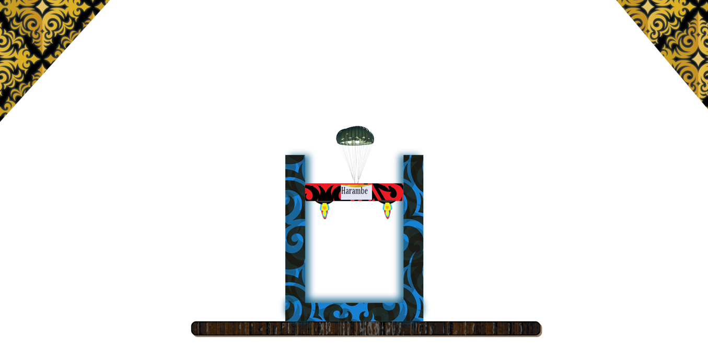
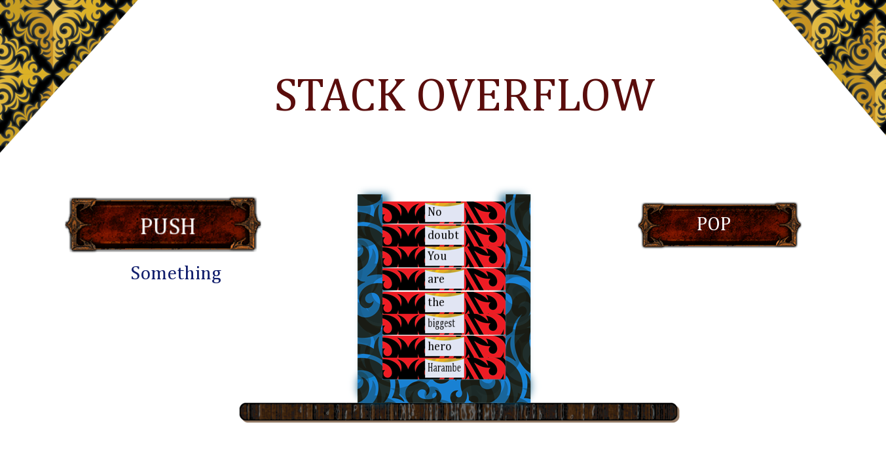
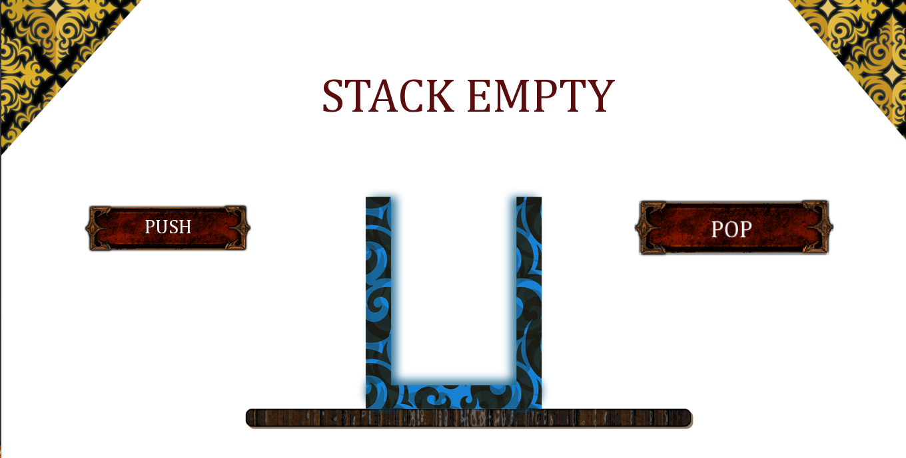

# Stack Animation

## Abstract

This project depicts the LIFO data structure, Stack, through carefully crafted animation and encompasses all the rudimentary operations.

## Build instructions

Please utilize the ``Stack Animation.sln`` file to create a Visual Studio project and set the build target to ``x86``.

## Screenshots

